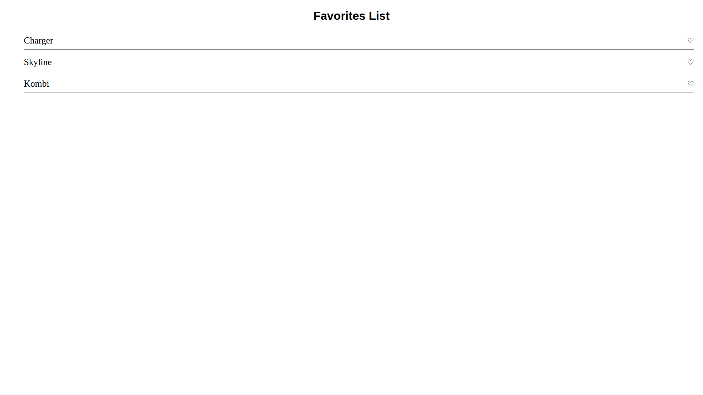
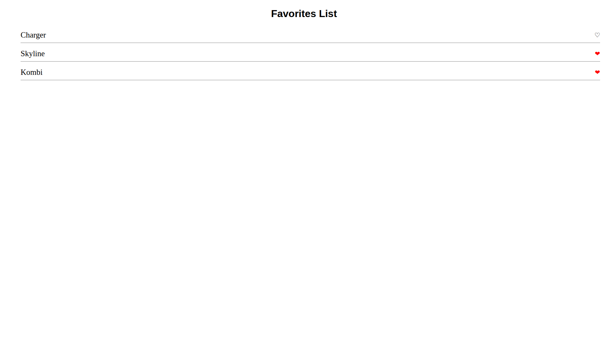

# [FreeCodeCamp] Build a Favorite Icon Toggler

❤️ Interactive list where you can toggle favorite icons by clicking on them.  
The goal is to practice DOM manipulation, event handling, and dynamic class toggling in JavaScript.

---

### 💻 Project Files
This project includes:
- `index.html`
- `styles.css`
- `script.js`

---

### 📷 Screenshot

