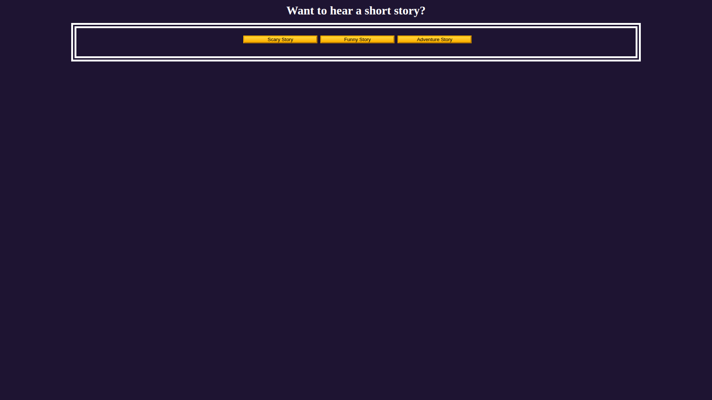
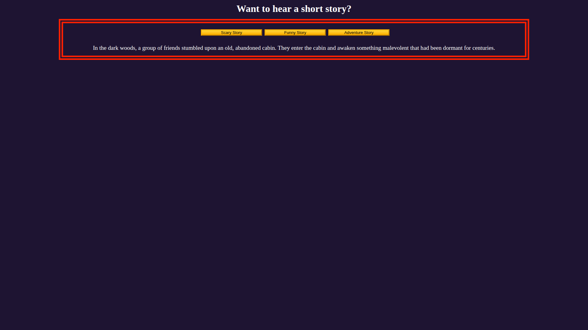
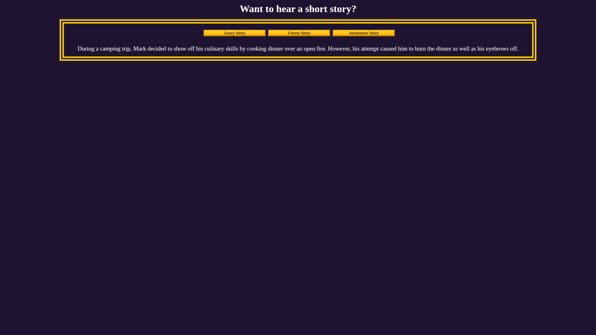
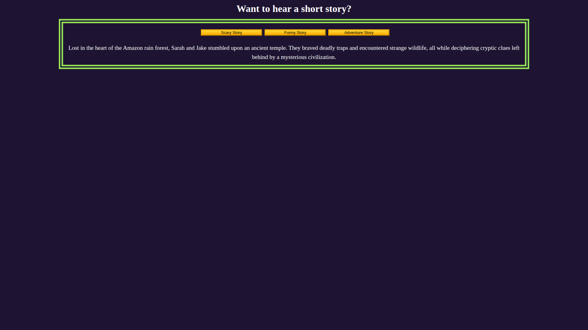

    # [FreeCodeCamp] Build a Story App

📖 Interactive story app with buttons to switch between genres (Scary, Funny, Adventure).  
The goal is to practice handling events, the DOM, and JavaScript objects.

---

### 💻 Project Files
This project includes:
- `index.html`
- `style.css`
- `index.js`

---

### 📷 Screenshot

